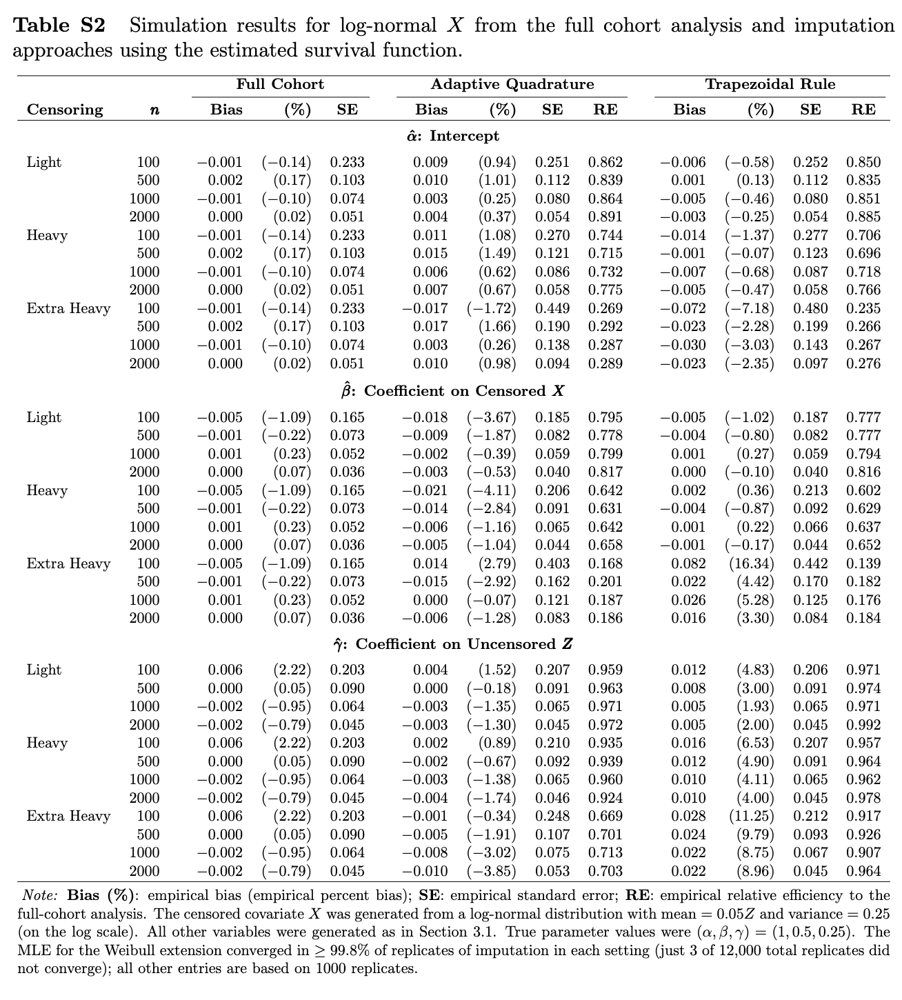

# It’s integral: Replacing the trapezoidal rule to remove bias and correctly impute censored covariates with their conditional means

This repository contains R code and simulation data to reproduce results from the manuscript by Lotspeich and Garcia (2022+). 

For the `imputeCensRd` package, which implements the conditional mean imputation approaches from the paper, can be found in its own repo [here](https://github.com/sarahlotspeich/imputeCensRd). 

Each of the "Script (Run Simulations)" files is coded to run 1 replication of each setting for demonstration. Per the NOTES at the bottom of the scripts, simulations for Tables 2-S1 and Figures S2-S5 were run in parallel.

## Tables 

**Table 1.** Simulation results for Weibull $X$ from the full cohort analysis and imputation approaches using the true survival function and adaptive quadrature versus the trapezoidal rule.
<!--  -->

  - [Script (Run Simulations)](Sim-Scripts/Table1-Gold-Standard.R)
  - [Script (Make Figure)](Table-Scripts/Table1-Gold-Standard.R)
  - [Data (Simulation Results)](Table-Data/data_Table1.csv)  

**Table 2.** Simulation results for Weibull $X$ from the full cohort analysis and imputation approaches using the estimated survival function and adaptive quadrature versus the trapezoidal rule.
<!--  -->

  - [Script (Run Simulations)](Sim-Scripts/Table2-Estimated-WeibullX.R)
  - [Script (Make Figure)](Table-Scripts/Table2-Estimated-WeibullX.R)
  - [Data (Simulation Results)](Table-Data/data_Table2.csv)  

**Table S1.** Simulation results for Weibull $X$ from the full cohort analysis and imputation approaches using the true survival function, assuming that $X$ was independent of $Z$.
<!--  -->

  - [Script (Run Simulations)](Sim-Scripts/TableS1-Gold-Standard-XindepZ.R)
  - [Script (Make Figure)](Table-Scripts/TableS1-Gold-Standard-XindepZ.R)
  - [Data (Simulation Results)](Table-Data/data_TableS1.csv)  

**Table S2.** Simulation results for log-normal $X$ from the full cohort analysis and imputation approaches using the estimated survival function and adaptive quadrature versus the trapezoidal rule.
<!--  -->

  - [Script (Run Simulations)](Sim-Scripts/TableS2-Estimated-LogNormalX.R)
  - [Script (Make Figure)](Table-Scripts/TableS2-Estimated-LogNormalX.R)
  - [Data (Simulation Results)](Table-Data/data_TableS2.csv)  

## Figures 

**Figure S1.** Illustration of the four extrapolation methods for a step survival function $\widehat{S}(t)$ in simulated data.

  - [Script (Make Figure)](Figure-Scripts/FigureS1-Illustrate-Extrapolation-Methods.R)
  
**Figure S2.** With Weibull $X$, extrapolating Breslow's estimator $\widehat{S}_0(t)$ beyond the largest uncensored value $\widetilde{X}$ with the Weibull extension offered the lowest bias and best efficiency for $\hat{\beta}$ in conditional mean imputation with adaptive quadrature.

  - [Script (Run Simulations)](Sim-Scripts/FigureS2.R)
  - [Script (Make Figure)](Figure-Scripts/FigureS2-Extrapolation-Methods-Weibull.R)
  - [Data (Simulation Results)](Figure-Data/data_FigureS2.R)  

**Figure S3.** With log-normal $X$, extrapolating Breslow's estimator $\widehat{S}_0(t)$ beyond the largest uncensored value $\widetilde{X}$ with any of the three extrapolation methods offered similar bias and efficiency for $\hat{\beta}$ in conditional mean imputation with adaptive quadrature.

  - [Script (Run Simulations)](Sim-Scripts/FigureS3.R)
  - [Script (Make Figure)](Figure-Scripts/FigureS3-Extrapolation-Methods-Log-Normal.R)
  - [Data (Simulation Results)](Figure-Data/data_FigureS3.R)  

**Figure S4.** Interpolating Breslow's estimator $\widehat{S}_0(t)$ between uncensored values with either of the two interpolation methods offered similar bias and efficiency for $\hat{\beta}$ in conditional mean imputation with adaptive quadrature. 

  - [Script (Run Simulations)](Sim-Scripts/FigureS4.R)
  - [Script (Make Figure)](Figure-Scripts/FigureS4-Interpolation-Methods.R)
  - [Data (Simulation Results)](Figure-Data/data_FigureS4.R)  

**Figure S5.** Extrapolating Breslow's estimator $\widehat{S}_0(t)$ beyond the largest uncensored value $\widetilde{X}$ with any of the three extrapolation methods offered similar bias and efficiency for $\hat{\beta}$ in conditional mean imputation with the trapezoidal rule.

  - [Script (Run Simulations)](Sim-Scripts/FigureS5.R)
  - [Script (Make Figure)](Figure-Scripts/FigureS5-Extrapolation-Methods-Trapezoidal-Rule.R)
  - [Data (Simulation Results)](Figure-Data/data_FigureS5.R)  

**Figure S6.** Due to the Weibull distribution's skewness, higher censoring rates led to smaller values of $W_{(n)}$ (the maximum of the observed covariate), which led to worse performance (i.e., higher bias) when calculating the conditional mean with the trapezoidal rule.

  - [Script (Make Figure)](Figure-Scripts/FigureS6-Weibull-vs-Log-Normal.R) 
