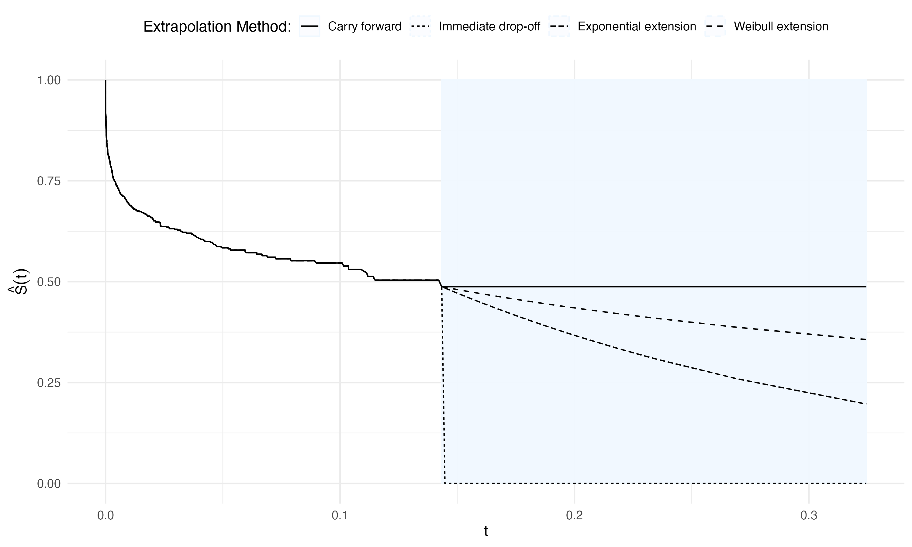

# It’s integral: Replacing the trapezoidal rule to remove bias and correctly impute censored covariates with their conditional means

This repository contains R code and simulation data to reproduce results from the manuscript by Lotspeich and Garcia (2022+).

## Tables 

**Table 1.** Simulation results for Weibull $X$ from the full cohort analysis and imputation approaches using the true survival function and adaptive quadrature versus the trapezoidal rule.
<!--  -->

  - [Script (Run Simulations)](Sim-Scripts/Table1.R)
  - [Script (Make Figure)](Table-Scripts/Table1-Gold-Standard.R)
  - [Data (Simulation Results)](Table-Data/data_Table1.csv)  

  - [Script (Run Simulations)](Sim-Scripts/Table2.R)
  - [Script (Make Figure)](Table-Scripts/Table2-Estimated-WeibullX.R)
  - [Data (Simulation Results)](Table-Data/data_Table2.csv)  

  - [Script (Run Simulations)](Sim-Scripts/TableS1.R)
  - [Script (Make Figure)](Table-Scripts/TableS1-Estimated-LogNormal.R)
  - [Data (Simulation Results)](Table-Data/data_TableS1.csv)  

## Figures 

  - [Script (Make Figure)](Figure-Scripts/FigureS1 - Illustrate Extrapolation Methods.R)
  

  - [Script (Run Simulations)](Sim-Scripts/FigureS2.R)
  - [Script (Make Figure)](Figure-Scripts/FigureS2 - Extrapolation Methods (Weibull).R)
  - [Data (Simulation Results)](Figure-Data/data_FigureS2.R)  

## `Sim-Scripts/`: Scripts to reproduce simulations 

`R` scripts to reproduce all simulated results can be found in the `Sim-Scripts/` subdirectory. 

  -  `Table1.R`: Simulation results for Weibull $X$ from the full cohort analysis and imputation approaches using the true survival function and adaptive quadrature versus the trapezoidal rule.
  -  `Table2.R`: 
  -  `TableS1.R`: 
  -  `FigureS1.R`: Illustration of the four extrapolation methods for a step survival function $\widehat{S}(t)$ in simulated data.
  -  `FigureS2.R`: With Weibull $X$, extrapolating Breslow's estimator $\widehat{S}_0(t)$ beyond the largest uncensored value $\widetilde{X}$ with the Weibull extension offered the lowest bias and best efficiency for $\hat{\beta}$ in conditional mean imputation with adaptive quadrature.
  -  `FigureS3.R`: With log-normal $X$, extrapolating Breslow's estimator $\widehat{S}_0(t)$ beyond the largest uncensored value $\widetilde{X}$ with any of the three extrapolation methods offered similar bias and efficiency for $\hat{\beta}$ in conditional mean imputation with adaptive quadrature.
  -  `FigureS4.R`: Interpolating Breslow's estimator $\widehat{S}_0(t)$ between uncensored values with either of the two interpolation methods offered similar bias and efficiency for $\hat{\beta}$ in conditional mean imputation with adaptive quadrature. 
  -  `FigureS5.R`: Extrapolating Breslow's estimator $\widehat{S}_0(t)$ beyond the largest uncensored value $\widetilde{X}$ with any of the three extrapolation methods offered similar bias and efficiency for $\hat{\beta}$ in conditional mean imputation with the trapezoidal rule.
  -  `FigureS6.R`: Due to the Weibull distribution's skewness, higher censoring rates led to smaller values of $W_{(n)}$ (the maximum of the observed covariate), which led to worse performance (i.e., higher bias) when calculating the conditional mean with the trapezoidal rule.

Each of these scripts is coded to run 1 replication of each setting for demonstration. Per the NOTES at the bottom of the scripts, simulations for Tables2--S1 and Figures S2--S5 were run in parallel.

## `Table-Scripts/`: Scripts to create tables

`R` scripts to reproduce the tables of simulated results can be found in the `Table-Scripts/` subdirectory. 

  -  `Table1.R`: Simulation results for Weibull $X$ from the full cohort analysis and imputation approaches using the true survival function and adaptive quadrature versus the trapezoidal rule.
  -  `Table2.R`: Simulation results for Weibull $X$ from the full cohort analysis and imputation approaches using the estimated survival function and adaptive quadrature versus the trapezoidal rule.
  -  `TableS1.R`: Simulation results for log-normal $X$ from the full cohort analysis and imputation approaches using the estimated survival function and adaptive quadrature versus the trapezoidal rule. 

## `Table-Data/`: Results from simulations to be displayed in tables 

Many simulations were run in parallel for more efficient computation. Individual `.csv` files from each "batch" of simulations (i.e., 50 replicates with a particular random seed) can be found in the named subdirectories for each table (e.g., `Table2/`). To build the tables above, these individual files have been combined (i.e., stacked using `rbind()`) into a single file per table, named like `data_Table#.csv`. 

  -  `data_Table1.csv`: Simulation results for Weibull $X$ from the full cohort analysis and imputation approaches using the true survival function and adaptive quadrature versus the trapezoidal rule.
  -  `data_Table2.csv`: Simulation results for Weibull $X$ from the full cohort analysis and imputation approaches using the estimated survival function and adaptive quadrature versus the trapezoidal rule.
  -  `data_TableS1.csv`: Simulation results for log-normal $X$ from the full cohort analysis and imputation approaches using the estimated survival function and adaptive quadrature versus the trapezoidal rule. 

## `Figure-Scripts/`: Scripts to create figures

`R` scripts to reproduce the figures of simulated results can be found in the `Figure-Scripts/` subdirectory. 

  -  `FigureS1.R`: Illustration of the four extrapolation methods for a step survival function $\widehat{S}(t)$ in simulated data.
  -  `FigureS2.R`: With Weibull $X$, extrapolating Breslow's estimator $\widehat{S}_0(t)$ beyond the largest uncensored value $\widetilde{X}$ with the Weibull extension offered the lowest bias and best efficiency for $\hat{\beta}$ in conditional mean imputation with adaptive quadrature.
  -  `FigureS3.R`: With log-normal $X$, extrapolating Breslow's estimator $\widehat{S}_0(t)$ beyond the largest uncensored value $\widetilde{X}$ with any of the three extrapolation methods offered similar bias and efficiency for $\hat{\beta}$ in conditional mean imputation with adaptive quadrature.
  -  `FigureS4.R`: Interpolating Breslow's estimator $\widehat{S}_0(t)$ between uncensored values with either of the two interpolation methods offered similar bias and efficiency for $\hat{\beta}$ in conditional mean imputation with adaptive quadrature. 
  -  `FigureS5.R`: Extrapolating Breslow's estimator $\widehat{S}_0(t)$ beyond the largest uncensored value $\widetilde{X}$ with any of the three extrapolation methods offered similar bias and efficiency for $\hat{\beta}$ in conditional mean imputation with the trapezoidal rule.
  -  `FigureS6.R`: Due to the Weibull distribution's skewness, higher censoring rates led to smaller values of $W_{(n)}$ (the maximum of the observed covariate), which led to worse performance (i.e., higher bias) when calculating the conditional mean with the trapezoidal rule.

## `Figure-Data/`: Results from simulations to be displayed in figures

Many simulations were run in parallel for more efficient computation. Individual `.csv` files from each "batch" of simulations (i.e., 50 replicates with a particular random seed) can be found in the named subdirectories for each table (e.g., `FigureS2/`). To build the tables above, these individual files have been combined (i.e., stacked using `rbind()`) into a single file per figure, named like `data_Figure#.csv`. 

  -  `data_FigureS2.csv`: With Weibull $X$, extrapolating Breslow's estimator $\widehat{S}_0(t)$ beyond the largest uncensored value $\widetilde{X}$ with the Weibull extension offered the lowest bias and best efficiency for $\hat{\beta}$ in conditional mean imputation with adaptive quadrature.
  -  `data_FigureS3.csv`: With log-normal $X$, extrapolating Breslow's estimator $\widehat{S}_0(t)$ beyond the largest uncensored value $\widetilde{X}$ with any of the three extrapolation methods offered similar bias and efficiency for $\hat{\beta}$ in conditional mean imputation with adaptive quadrature.
  -  `data_FigureS4.csv`: Interpolating Breslow's estimator $\widehat{S}_0(t)$ between uncensored values with either of the two interpolation methods offered similar bias and efficiency for $\hat{\beta}$ in conditional mean imputation with adaptive quadrature. 
  -  `data_FigureS5.csv`: Extrapolating Breslow's estimator $\widehat{S}_0(t)$ beyond the largest uncensored value $\widetilde{X}$ with any of the three extrapolation methods offered similar bias and efficiency for $\hat{\beta}$ in conditional mean imputation with the trapezoidal rule.
